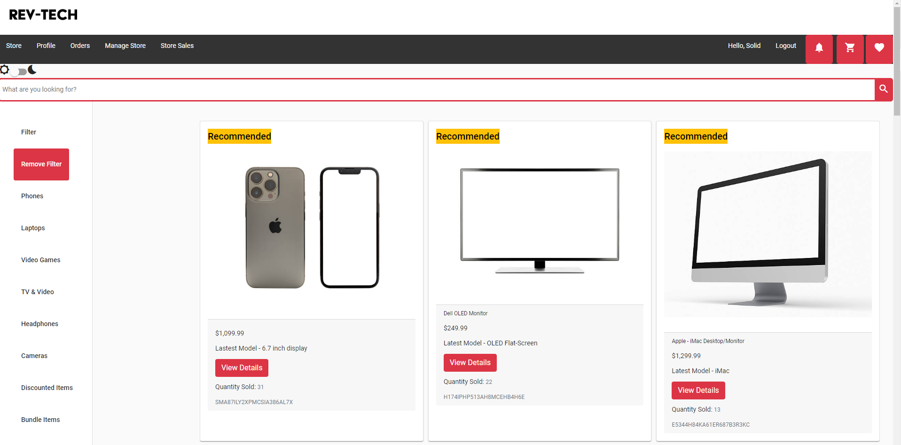

# Rev-Tech

Project 3 - E-Commerce Store (Team Project)

## Table of Contents 

* [Project Sprint 1 Description](#project-sprint-1-description)
* [Project Sprint 2 Description](#project-sprint-2-description)
* [Technologies Used](#technologies-used)
* [Sprint 1 Requirements](#sprint-1-requirements)
* [Sprint 2 Requirements](#sprint-2-requirements)
* [Legacy Features](#legacy-features)
* [New Features](#new-features)
* [Getting Started](#getting-started)
* [Application Screenshots](#application-screenshots)
* [Entity Relationship Diagram](#entity-relationship-diagram)
* [Contributors](#contributors)

## Project Sprint 1 & 2 Summary
RevTech is a Single Page E-Commerce Application with an assortment of high-tech gear. Anybody can browse the selection freely, but need to Register or Login to an Account if they want to purchase anything. RevTech keeps tracks of all purchases it's Users had and allows Admins to run special discounts on anything in stock. Individual Items can be added to a cart and purchased in bulk, or bought on the spot.

[//]: * "## Project Sprint 3 Description"

## Technologies Used 
* Java (Programming Language) - version 11.0.12
* TypeScript (Programming Language)
* HTML (HyperText Markup Language)
* CSS / SCSS (Cascading Style Sheets) plus Angular Material
* Eclipse (IDE)
* Spring Tools Suite (STS)
* Sonarlint (Code Refactorization)
* Apache Maven (Project Management)
* Node Package Manager (NPM)
* PostgreSQL (Database)
* H2 (Database)
* Amazon Web Services - Elastic Cloud Computing (AWS EC2)
* Amazon Web Services - Simple Storage Service (AWS S3)
* Amazon Web Services - CodePipeline
* Jenkins (Automation Server)
* Docker (Image Containerization)
* Hibernate ORM (Object Relational-Mapping Tool)
* Spring Framework (Spring Boot, Spring Data, Spring Web, Spring AOP, Spring Mail, Spring Jasypt)
* Spring Secuirty w/ JWT (JSON Web Token)
* Lombok
* JUnit 5 and Mockito (Testing Framework - Back)
* Selenium
* Angular2+ (Web Framework)
* Jasmine / Karma (Testing Framework - Front)
* Microsoft Visual Studio Code (Source Code Editor)
* Postman (API Platform)
* DBeaver (Database Administration Tool)

## Sprint 1 Requirements
1. As a User, I should be able to register a new account.
2. As a User, I should be able to log into the application.
3. As a User, I should be able to log out of the application.
4. As a User, I should be able to see a list of available products for me to add to my cart.
5. As a User, I should be able to search the product list to better find the item(s) I am interested in.
6. As a User, I should be able to see and purchase items that are on sale for a lower price.
7. As a User, I should be able to add items to my cart that I will later purchase or remove from my cart.
8. As a User, I should be able to select an amount of an item to add to my cart as I am adding an item.
9. As a User, I should be able to checkout with the items in my cart, purchasing them and removing them from the inventory.

## Sprint 2 Requirements
1. As a User, I should be able to reset my password.
2. As a User, I should be able to change the color scheme from the normal mode to a dark mode option.
3. As a User, I should be able to add item and checkout instantly.
4. As a User, I should be able to save items to a wish list to buy later.
5. As an Admin, I should be able to bundle certain items into a bulk deal with extra discount incentives.
6. As a User, I should receive email notifications when an item in my wish list is put on discount.

## Sprint 3 Requirements
1. As an Admin, I should be able to see a dashboard that will show me a trend of sales over the past Month, Quarter, or Year.
2. As a Admin, I should be able to recommend the top products and automatically mark products as best sellers.
3. As a User, I should be able to filter by the best selling products and see a label for the recommended products.
4. As a User, I should receive email notifications when a transaction has completed.
5. As a User, I should be able to buy accessories or secondary products that compliment or are relevant to my primary products.
6. As a User, I should be able to view a list of all my previous orders and access the details of each order.

## Legacy Features
List of previously implemented features
* Ability to register as a customer
* Ability to login as an customer or administrator
* Ability to view appropriate interfaces upon login dependent upon level of access (admin or customer)
* Ability to add a product to storefront as an administrator
* Ability to add a discounted product to storefront as an administrator
* Ability to update or remove a product from storefront as an administrator
* Ability to update or remove a discounted product from storefront as an administrator
* Ability to view account information as a user
* Ability to view the storefront as a user (including guest)
* Ability to view the discounted items as a user (including guest)
* Ability to view the product description page as a user
* Ability to add items to cart as a user
* Ability to select quantity of a particular item to add to cart as a user
* Ability to checkout as a user
* Ability to logout as a user
* Ability to add and view customer reviews as a user
* Ability to view orders history as a user
* Ability to reset password as a user
* Ability to switch background color from original theme (light) to dark theme by using Angular material
* Ability to add items and checkout instantly (buy now) as a user
* Ability to add items to a wish list for future purchase
* Ability to add items to bundled deals for the purpose of discounting cumulative items as an administrator
* Ability to send automated emails when any item on a user's wish list is discounted
* Ability to send automated emails when any item, or items on a user's wish list is part of a bundled deal

## New Features
* Ability to view a series of Graphs analyzing the Store's Monthly, Quarterly, and Yearly Sales History
* Ability to mark items as recommended as an admin
* Ability to view items marked as best selling as an admin or user
* Ability to send automated emails when a user makes a purchase
* Ability to view additional secondary items related to the items being actively viewed
* Ability to view additional details about prior order history transactions

## To-do list:
* Payment Plan Options
* Track User Searches
* Delivery Updates
* S3 Bucket
* Social Media

## Getting Started 
Please refer to `STARTUP.md` file

# Application Screenshots
Legacy Screenshots can be viewed from the Previous Sprint Team's Readme.
https://github.com/revature-revtech-3/project-3-front-end-beta/blob/presentation/OLD_README.md

# Entity Relationship Diagram

Contributors
-----
Scrum Master:
* Deagan Henderson

Team Lead:
* Kiersten Christlieb

Best Sellers & Recommended Products Team:
* Jorge Fernández
* Joy Umoekpo

Email Notifications Team:
* Lindi Porter
* Robert Williams

Notifications Team:
* Jack Che
* Jasson Mendoza

Sales Analytics Team:
* Christopher Costa
* Jaunzel Mullins

Secondary Products Team:
* Josh Edwards"
* Kouame Djah

View Previous Orders Team:
* Kiersten Christlieb
* Ryan LaCombe